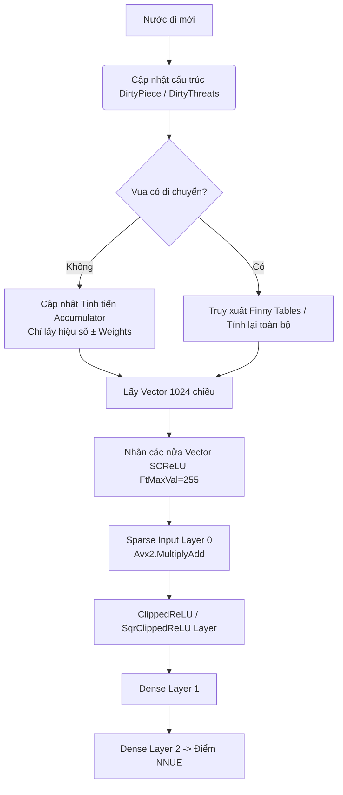

# Kế hoạch triển khai NNUE (Stockfish) sang C#

Dự án này nhằm mục đích port hệ thống NNUE hiện đại của Stockfish (gồm `HalfKAv2_hm` và `FullThreats`) sang C# (.NET 8/9) cho engine của bạn, tận dụng tối đa `System.Runtime.Intrinsics` (AVX2/AVX512) để đảm bảo tốc độ đánh giá (evaluation) đạt mức hàng chục triệu nodes/giây.

> [!IMPORTANT]
> Việc triển khai chia làm 5 giai đoạn chính. Mỗi giai đoạn sẽ được test độc lập trước khi ráp vào hệ thống search.

## Giai đoạn 1: Core Structures & Trình đọc File (NNUE IO)
- **Mục tiêu**: Đọc thành công file `.nnue` của Stockfish và nạp trọng số (weights/biases) vào bộ nhớ.
- **Chi tiết công việc**:
  - Viết bộ giải mã **LEB128** (chuẩn nén trọng số của Stockfish) bằng C#.
  - Định nghĩa các class/struct chứa trọng số cho `FeatureTransformer`, `AffineTransform`, `ClippedReLU`.
  - Khởi tạo mảng cấp phát bộ nhớ native (`unsafe`, `NativeMemory.Alloc` hoặc ghim mảng bằng `fixed`) để tối ưu cache line (64 bytes).
  - Tích hợp logic hoán vị trọng số (`PackusEpi16Order`) lúc load để bỏ qua bước xáo trộn trong vòng lặp tính toán.

## Giai đoạn 2: Định nghĩa các tập đặc trưng (Feature Sets)
- **Mục tiêu**: Ánh xạ bàn cờ thành các chỉ số (indices) đầu vào cho NNUE.
- **Chi tiết công việc**:
  - Triển khai **`HalfKAv2_hm`** (22,528 chiều): Thuật toán ánh xạ Vị trí Vua + Các quân cờ (có lật trục dọc E-H).
  - Triển khai **`FullThreats`** (60,720 chiều): Thuật toán tính toán các tia tấn công, quân bị tấn công dựa trên tầm nhìn của Vua.
  - Tối ưu hóa việc sinh các mảng `added` và `removed` indices khi có một nước đi.

## Giai đoạn 3: Hệ thống tích lũy (Accumulator & Incremental Updates)
- **Mục tiêu**: Cập nhật trạng thái mạng neural tịnh tiến sau mỗi nước đi thay vì tính lại từ đầu.
- **Chi tiết công việc**:
  - Xây dựng `Accumulator` stack lưu trạng thái của 1024 vector cho mỗi ply.
  - Cấu trúc `DirtyPiece` và `DirtyThreats` ghi nhận các thay đổi trên bàn cờ.
  - Implement bảng cache **Finny Tables** để phục hồi trạng thái mạng khi Vua di chuyển.
  - Viết logic `Forward Update` (cộng/trừ vector trọng số khi đi tiếp) và `Backward Update`.

## Giai đoạn 4: Mạng Neural SIMD (Inference Layers)
- **Mục tiêu**: Viết mã thực thi mạng neural sử dụng vector hóa (SIMD).
- **Chi tiết công việc**:
  - Triển khai **C# AVX2/AVX512 Intrinsics** (`System.Runtime.Intrinsics.X86`).
  - Lớp `FeatureTransformer`: Nhân chập (pairwise multiplication) với SCReLU.
  - Lớp `AffineTransformSparseInput`: Lan truyền thẳng cho Layer 0 (với mảng chỉ số Non-Zero sparse).
  - Lớp `AffineTransform` (Dense) & `ClippedReLU` cho Layer 1 và 2.
  - Descaling kết quả đầu ra thành centipawn (cp).

## Giai đoạn 5: Tích hợp vào Search & Engine
- **Mục tiêu**: Hook NNUE vào luồng Alpha-Beta Search của engine hiện tại.
- **Chi tiết công việc**:
  - Sửa đổi `Position.Do_Move()` để cập nhật `DirtyPiece` và `DirtyThreats`.
  - Thay thế hoặc kết hợp `Benchmark.Evaluate` cũ với hàm `NnueNetwork.Evaluate()`.
  - Tuning lại cấu trúc điểm số (độ pha trộn giữa Evaluation cũ và NNUE).
  - Benchmark hiệu năng `Nodes per second (NPS)`.

---

## Kiến trúc Luồng Dữ liệu (Sơ đồ)

